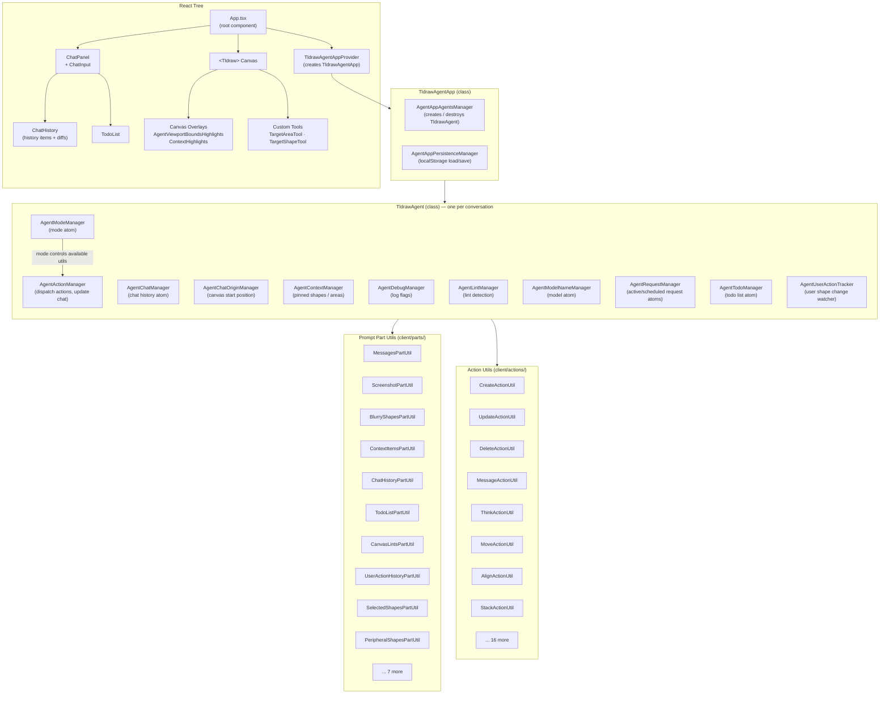
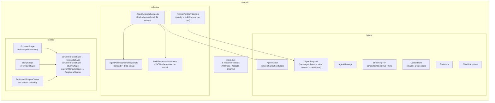
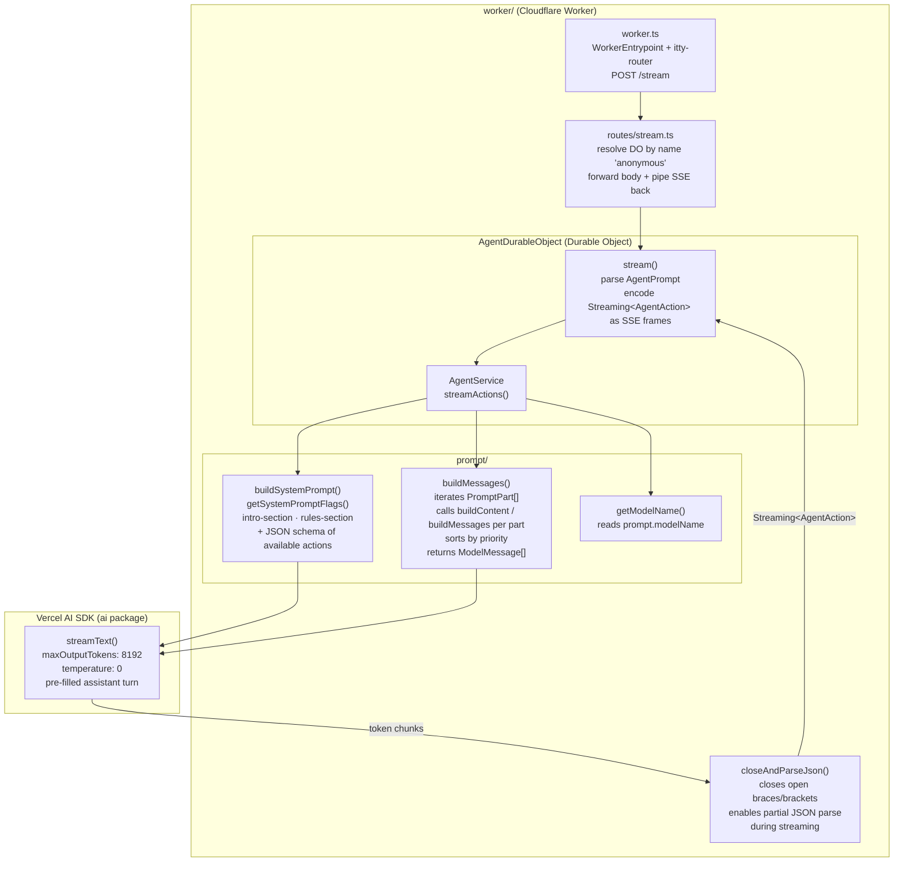
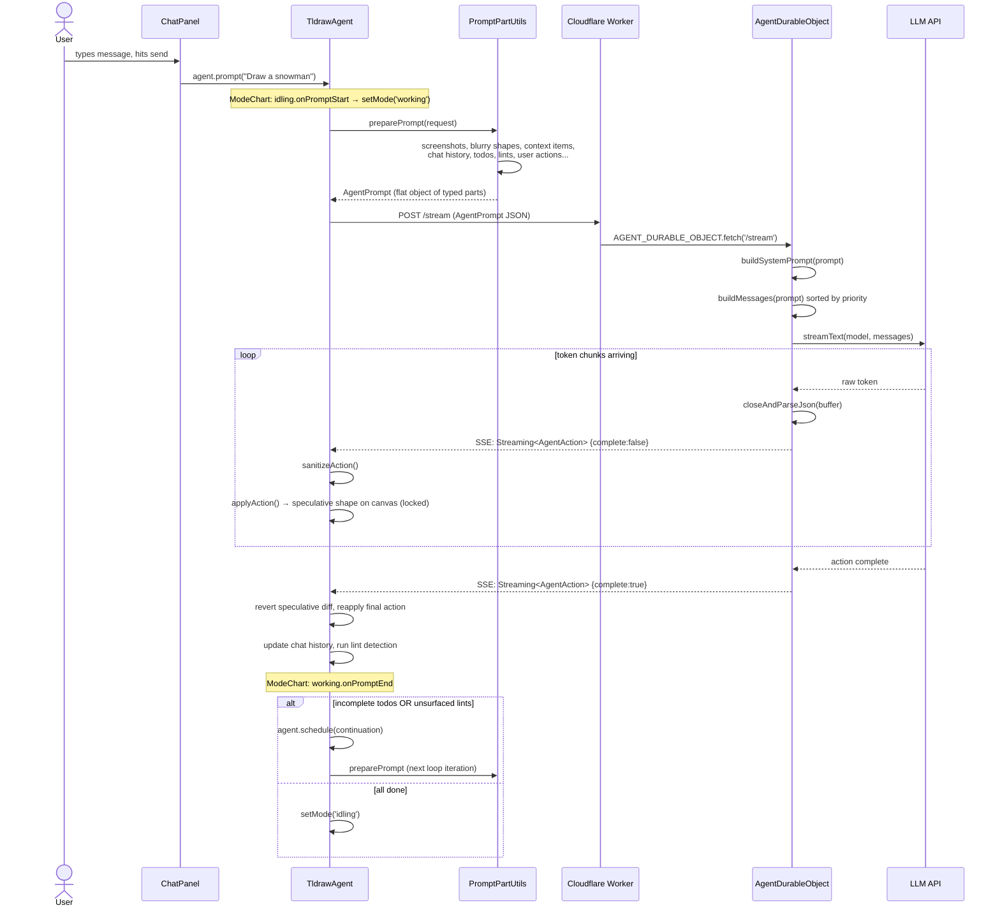
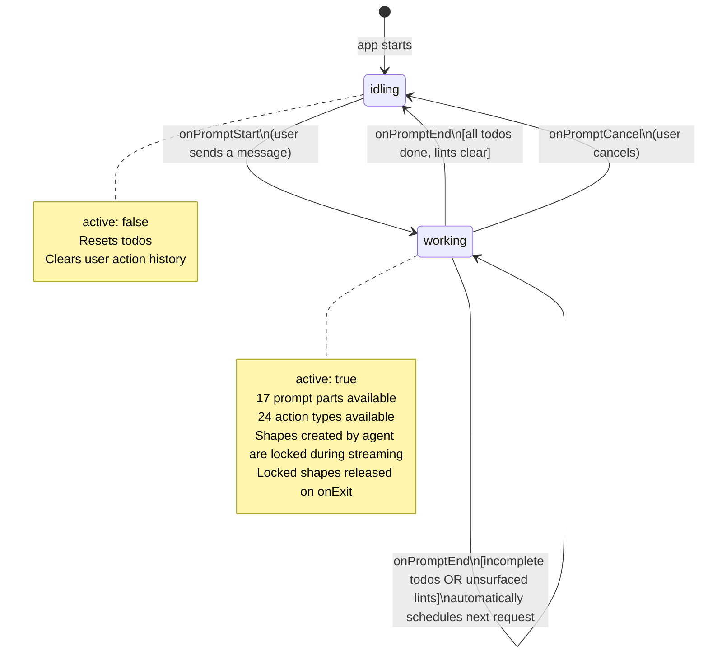

# Architecture

This document maps the full architecture of the tldraw agent app so you can understand how the pieces fit together and where to extend them.

---

## 1. System Overview

Three main layers: the browser client, a Cloudflare Worker backend, and external LLM APIs.

```mermaid
graph TB
    subgraph Browser["Browser (React + tldraw)"]
        UI["UI Layer\nChatPanel · TodoList · Highlights"]
        AgentApp["TldrawAgentApp\n(app coordinator)"]
        Agent["TldrawAgent\n(per-conversation brain)"]
        Parts["Prompt Part Utils\n(assemble prompt)"]
        Actions["Action Utils\n(apply actions to canvas)"]
        Modes["Mode System\n(idling / working)"]
    end

    subgraph Worker["Cloudflare Worker"]
        Router["worker.ts\n(itty-router)"]
        StreamRoute["routes/stream.ts"]
        DO["AgentDurableObject\n(Durable Object)"]
        Service["AgentService\n(LLM caller)"]
        PromptBuilder["prompt/\nbuildSystemPrompt · buildMessages"]
    end

    subgraph LLMs["LLM APIs"]
        Anthropic["Anthropic\nClaude"]
        Google["Google\nGemini"]
        OpenAI["OpenAI\nGPT"]
    end

    UI -->|user input| Agent
    Agent -->|getPart()| Parts
    Parts -->|AgentPrompt JSON| Router
    Router --> StreamRoute
    StreamRoute -->|stub name 'anonymous'| DO
    DO --> Service
    Service --> PromptBuilder
    PromptBuilder -->|ModelMessage[]| Service
    Service -->|streamText| Anthropic & Google & OpenAI
    Service -->|Streaming AgentAction SSE| DO
    DO -->|SSE text/event-stream| Browser
    Agent -->|applyAction()| Actions
    Actions -->|tldraw editor calls| UI
    Modes -->|controls available parts & actions| Agent
```

---

## 2. Client Layer

Shows the React/agent class hierarchy and how all managers, parts, and actions hang together.



---

## 3. Shared Layer

Types, Zod schemas, and shape format converters used by both client and worker.



---

## 4. Worker Layer

How a request becomes LLM messages and streams back as actions.



---

## 5. End-to-End Request Data Flow

Sequence of a single user prompt through the entire system.



---

## 6. Mode State Machine

How the agent transitions between modes and what hooks fire.



---

## 7. How to Extend

Use this table to know which file(s) to touch for each type of extension.

| Goal | File(s) to edit |
|---|---|
| Add a new **action** the agent can take | `shared/schema/AgentActionSchemas.ts` (schema) + `client/actions/YourActionUtil.ts` (behavior) + `client/modes/AgentModeDefinitions.ts` (enable in mode) |
| Add new **information** the agent can see | `shared/schema/PromptPartDefinitions.ts` (server render) + `client/parts/YourPartUtil.ts` (data collection) + `client/modes/AgentModeDefinitions.ts` (enable in mode) |
| Add a new **mode** with different capabilities | `client/modes/AgentModeDefinitions.ts` (definition) + `client/modes/AgentModeChart.ts` (lifecycle hooks) |
| Change **system prompt** wording or rules | `worker/prompt/buildSystemPrompt.ts` + `worker/prompt/sections/` |
| Add a new **LLM model** | `shared/models.ts` + `worker/do/AgentService.ts` |
| Add a **custom tldraw shape** the agent can create | `shared/format/FocusedShape.ts` + `shared/format/convertTldrawShapeToFocusedShape.ts` + `shared/format/convertFocusedShapeToTldrawShape.ts` |
| Add agent-side **state** (new manager) | `client/agent/managers/YourManager.ts` (extend `BaseAgentManager`) + `client/agent/TldrawAgent.ts` (instantiate) |
| Add app-level **state** (new app manager) | extend `BaseAgentAppManager` + add to `TldrawAgentApp.ts` |
| Add a new **canvas tool** | `client/tools/YourTool.tsx` + register in `App.tsx` `tools` array |
| Persist per-user DO state | change the stub name in `worker/routes/stream.ts` from `'anonymous'` to a user ID |
| Change how actions **stream/speculate** | `client/agent/TldrawAgent.ts` → `requestAgentActions()` |
